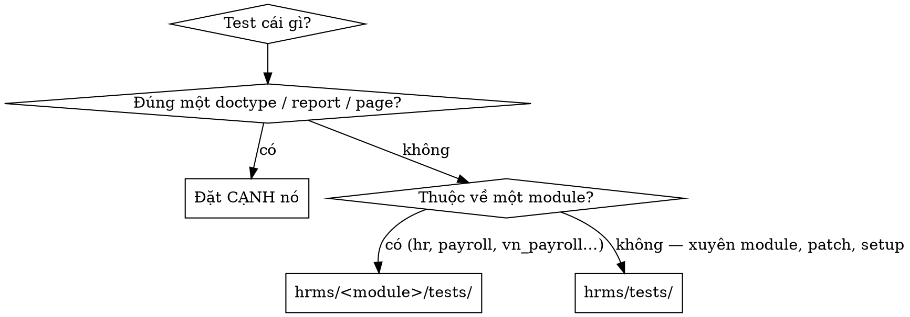

# File placement (Miyano HR)

## Overview

`scripts/check_file_placement.py` là **nguồn sự thật duy nhất** về vị trí và tên file.
Nó chạy ở hai chỗ: PreToolUse hook (chặn lúc `Write` tạo file mới) và pre-commit
(quét cả cây). Skill này không chép lại luật đó — nó trả lời thứ máy không quyết được:
**chọn thư mục nào khi có nhiều chỗ hợp lệ, và một thứ mới cần những file gì.**

Bị chặn? Chạy `python3 scripts/check_file_placement.py <đường-dẫn>` để xem luật nào vướng.

## Quyết định khó nhất: test này đi đâu?

Có hai chỗ đều hợp lệ, chọn sai thì không bị chặn nhưng vẫn sai:

**Cạnh doctype là bắt buộc, không phải tuỳ chọn:** Frappe nạp `test_records.json` theo
đúng đường dẫn `hrms/<module>/doctype/<tên>/`. Chuyển test của doctype đi nơi khác là
cắt luôn fixture của nó.

| Ví dụ | Hợp lệ |
|---|---|
| `hrms/hr/doctype/attendance/test_attendance.py` | ✅ |
| `hrms/hr/report/leave_ledger/test_leave_ledger.py` | ✅ |
| `hrms/hr/tests/test_working_hours.py` | ✅ |
| `hrms/vn_payroll/tests/test_mvl.py` | ✅ |
| `hrms/tests/test_setup_vn_defaults.py` | ✅ |
| `hrms/hr/test_working_hours.py` | ❌ |
| `hrms/vn_payroll/test_mvl.py` | ❌ |
| `hrms/patches/v15_0/test_backfill_attendance_codes.py` | ❌ |

Thư mục `tests/` ở đây là namespace package — **không** thêm `__init__.py`.

## Script chạy `bench execute` KHÔNG được vào scripts/

`bench execute` import theo đường dẫn package: `bench --site miyano execute hrms.foo.bar`.
`scripts/` nằm ngoài package `hrms` nên không import được. Công cụ vận hành, chẩn đoán,
sửa dữ liệu → **`hrms/`** (xem `hrms/skip_attendance_diag.py`). `scripts/` chỉ dành cho
tooling của repo chạy bằng `python3` trực tiếp.

## Scaffolding: thứ mới cần những file gì

**Doctype mới** — `hrms/<module>/doctype/<snake_case>/`, tên thư mục là snake_case của tên doctype:
- `<tên>.json` (schema) · `<tên>.py` (controller) · `<tên>.js` (desk form) · `test_<tên>.py`
- `__init__.py`
- Module mới thì thêm vào `hrms/modules.txt`
- Đổi schema → `bench --site miyano migrate`

**Report mới** — `hrms/<module>/report/<snake_case>/` với `<tên>.json` + `<tên>.py` + `test_<tên>.py`.

**Patch mới** — `hrms/patches/v15_0/<snake_case>.py` **và bắt buộc thêm một dòng vào
`hrms/patches.txt`**. Thiếu dòng đó thì patch không bao giờ chạy — không lỗi, không cảnh
báo, chỉ là im lặng vô dụng. Test của patch đi vào `hrms/tests/`, không để cùng thư mục patch.

**Tài liệu** — spec vào `docs/spec/<kebab-case>.md`, kế hoạch vào `docs/tasks/plan-<kebab-case>.md`.
`spec/` và `tasks/` ở gốc repo đã bị dọn 2026-08-14, đừng lập lại.

## Đặt tên

Máy đã ép: không dấu cách; `.py` snake_case; `.vue` PascalCase; test dùng **tiền tố**
`test_` (hậu tố `_test.py` sẽ không bao giờ được Frappe gom); thư mục doctype/report/page
snake_case. Hai chỗ máy **không** ép vì repo vốn không nhất quán — tự giữ nhất quán với
hàng xóm: tên `.js`/`.ts` trong `frontend/`, `roster/` (file mới nên camelCase), và tên
file phụ trong thư mục doctype (Frappe dùng `<tên>_list.js`, `<tên>_dashboard.py`).

DocType và fieldname đặt **tiếng Anh**; nhãn hiển thị mới là tiếng Việt (qua translations).

## Sai lầm thường gặp

| Làm | Vì sao hỏng |
|---|---|
| Để test cạnh mã nguồn "cho gần" | Đúng lỗi đã phải dọn 52 file ngày 2026-08-14 |
| Chuyển test doctype vào `tests/` cho "gọn" | Mất `test_records.json`, fixture chết |
| Thêm patch mà quên `patches.txt` | Patch không bao giờ chạy, im lặng |
| Đưa công cụ `bench execute` vào `scripts/` | Không import được, lệnh gãy ngay |
| Thêm `__init__.py` vào `tests/` mới | Lệch với `hrms/tests/`, `hrms/controllers/tests/` |
| Viết `.md` ra gốc repo | Tài liệu vào `docs/` |
